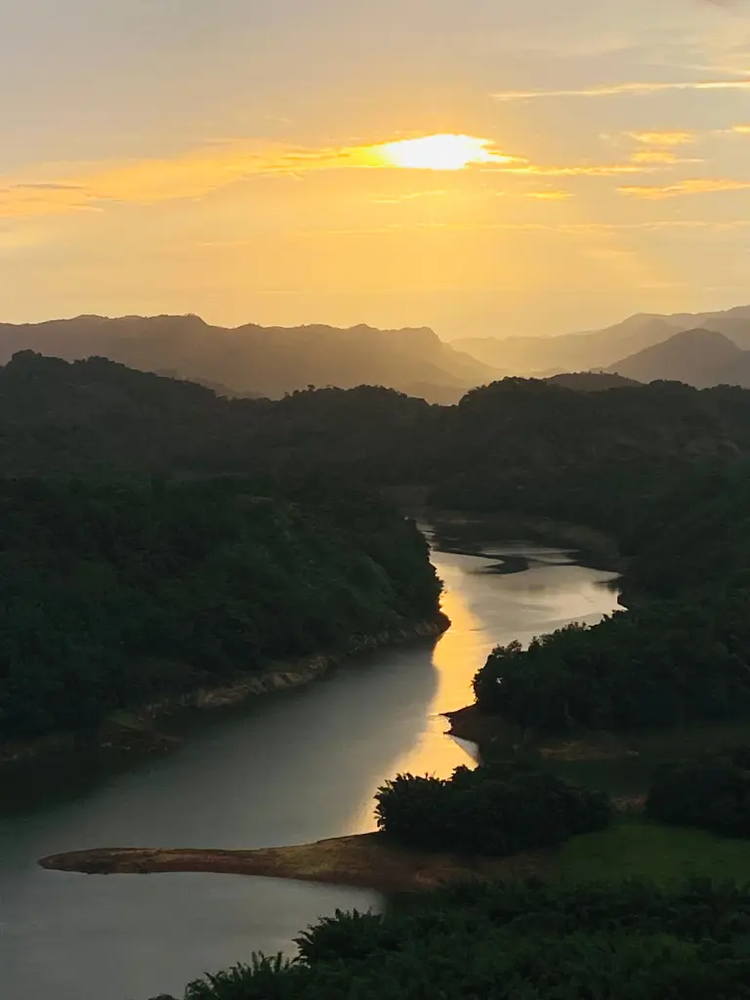
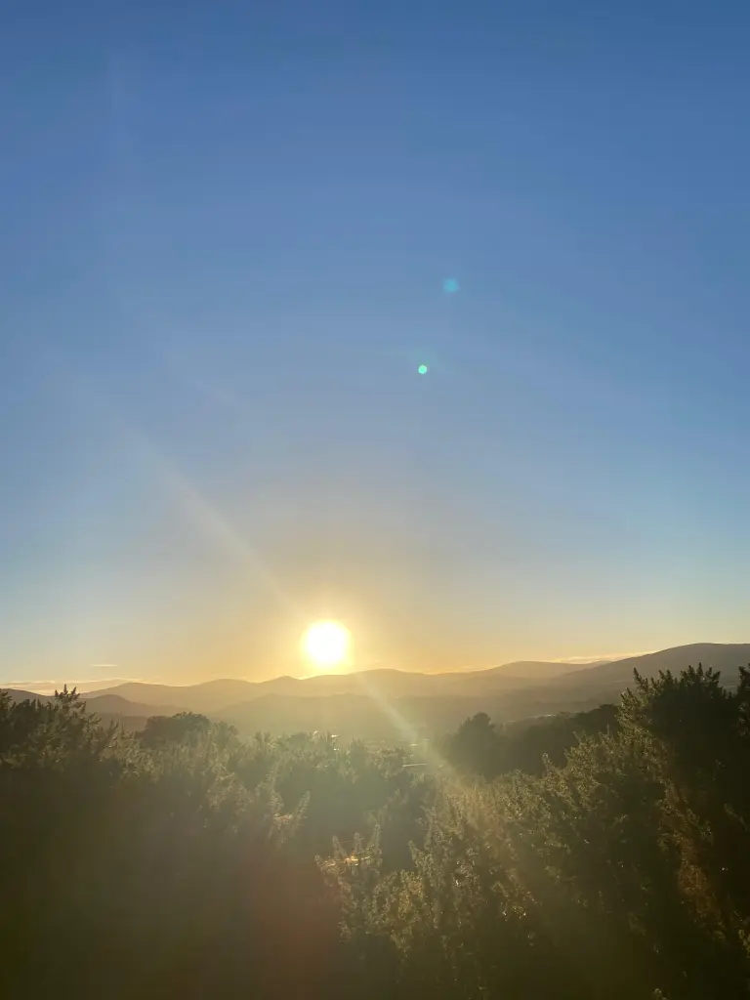
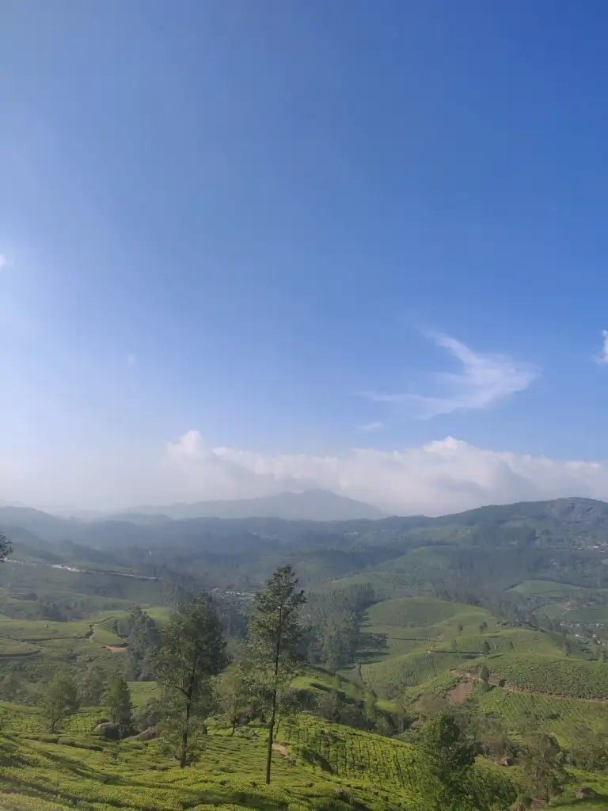
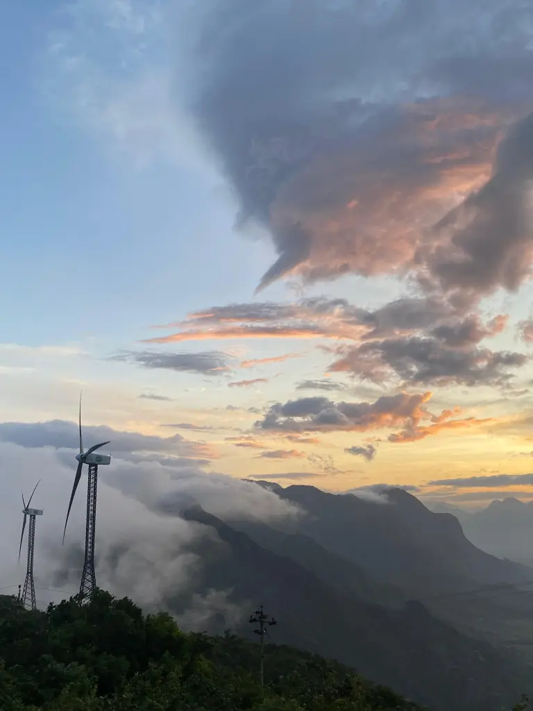
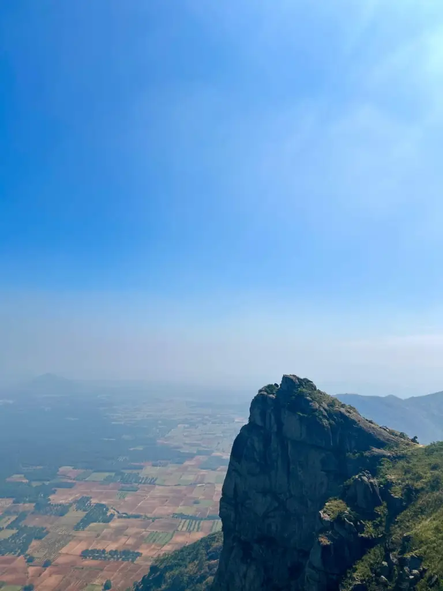

Tucked away in the heart of Kerala’s Western Ghats, Idukki is a land where nature unveils her artistic brilliance in every shade of green and gold, mist and sunlight. With its endless hills, mist-draped valleys, sprawling tea gardens, and cloud-kissed meadows, Idukki is a breathtaking canvas that leaves every traveler spellbound. This district is not just a destination; it is an immersive journey into nature’s masterpiece—raw, serene, and spectacular.Let’s take a closer look at five of Idukki’s finest jewels: Ponmudi, Vagamon, Munnar, Chathurangapara, and Ramakkalmedu.

## Ponmudi: A Hidden Gem in the Highlands

Idukki’s Ponmudi is an underrated treasure waiting to be explored. Nestled amidst thick forests and rolling hills, Ponmudi in Idukki is a tranquil escape. The highlight here is the Ponmudi Dam, a stunning reservoir surrounded by forested slopes. The serene backwaters mirror the sky, adding to its picturesque charm. Unlike other commercial hill stations, Ponmudi remains untouched and quiet, perfect for nature walks, bird watching, or simply soaking in the stillness.What makes Ponmudi special is the seamless blend of water and woodland, a balance that soothes the senses. The area is also home to tribal communities, giving visitors a peek into the indigenous cultures that co-exist harmoniously with the wilderness.

## Vagamon: Meadows in the Mist

Vagamon, often referred to as the “Scotland of Asia,” lies on the border of Idukki and Kottayam districts. With its velvety meadows, pine forests, and winding roads, Vagamon is pure poetry. The chill in the air, the fog that rolls in without a warning, and the panoramic vistas create an ethereal atmosphere that captivates every soul.Adventure seekers find solace in Vagamon’s trekking trails and paragliding opportunities, while spiritual travelers are drawn to the Kurisumala Ashram and the harmonious blend of Christian, Hindu, and Muslim communities living side by side. The Vagamon Pine Forest, a man-made wonder, stands tall and silent, offering a surreal escape into nature.Vagamon is where nature whispers in the wind and paints her masterpiece in muted tones of green, grey, and blue.

## Munnar: The Queen of the Hills

No mention of Idukki can be complete without Munnar. Crowned as ‘The queen of Kerala’s hill stations’, Munnar is where rolling tea gardens stretch to infinity, and the aroma of fresh tea blends with the fragrance of wildflowers. Perched at over 1,500 meters above sea level, Munnar was once the summer resort of the British, and its colonial charm lingers even today.The Kolukkumalai Tea Estate, the highest tea plantation in the world, is a must-visit for its views and vintage tea factory. Eravikulam National Park, home to the endangered Nilgiri Tahr, offers scenic treks and a chance to witness the rare Neelakurinji flower that blooms once every 12 years.Munnar is not just a destination; it’s a feeling—of cool air on your face, of sipping hot chai overlooking misty hills, of getting lost in nature’s elegance.

## Chathurangapara: A Cloud Walker’s Paradise

Perched on the Kerala-Tamil Nadu border, Chathurangapara is a lesser-known viewpoint that rewards visitors with spectacular panoramas. Here, you don’t just see the clouds—you walk through them. On a good day, the entire valley is veiled in white, with only the peaks of distant hills piercing through the mist.Sunsets at Chathurangapara are spellbinding, with hues of orange and crimson splashing across the sky. Unlike popular tourist spots, this offbeat gem promises solitude and a front-row seat to nature’s grandeur. It is ideal for campers, trekkers, and photographers who seek the untouched beauty of Idukki.

## Ramakkalmedu: Where Legends and Winds Collide

Ramakkalmedu is where myth and wind meet. Legend has it that Lord Rama set foot here during his search for Sita, giving the hill its name—‘Ramakkalmedu’ meaning “Land of Rama’s Rock”. Situated at 3,500 feet above sea level, this peak offers one of the most panoramic views in Idukki. On a clear day, one can see the vast plains of Tamil Nadu, with tiny settlements dotting the landscape.But it’s not just the view that attracts visitors. Ramakkalmedu is one of the windiest places in Asia, and the powerful gusts here are harnessed by giant windmills that dot the ridges. The Kuravan and Kurathi statues, symbolizing the tribal couple who helped build the Idukki Dam, stand tall against the sky, adding both history and meaning to the landscape.Ramakkalmedu is a fusion of legend, nature, and sustainability—a testament to how man and nature can co-exist in harmony.

Idukki is not merely a collection of hill stations and viewpoints—it’s an ever-evolving painting by nature. From the poetic charm of Vagamon to the wild whisper of Chathurangapara, from the colonial beauty of Munnar to the windswept heights of Ramakkalmedu, every corner tells a story. It is where mist hugs the mountains, rivers sing lullabies, and every sunset feels like a farewell kiss from nature herself.