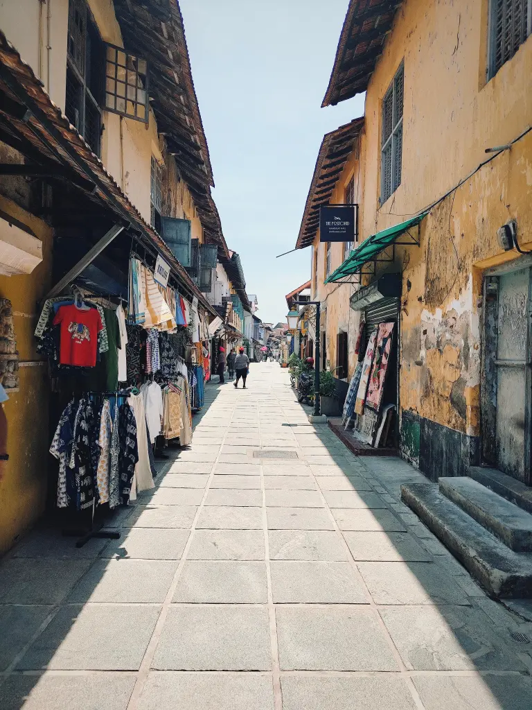
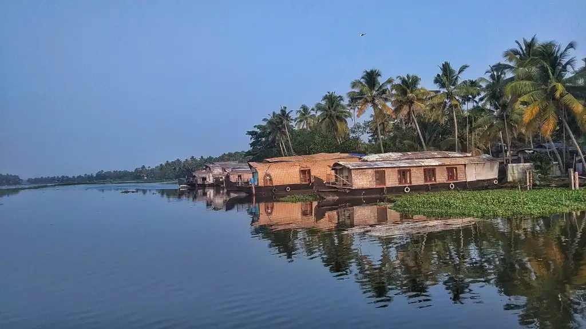
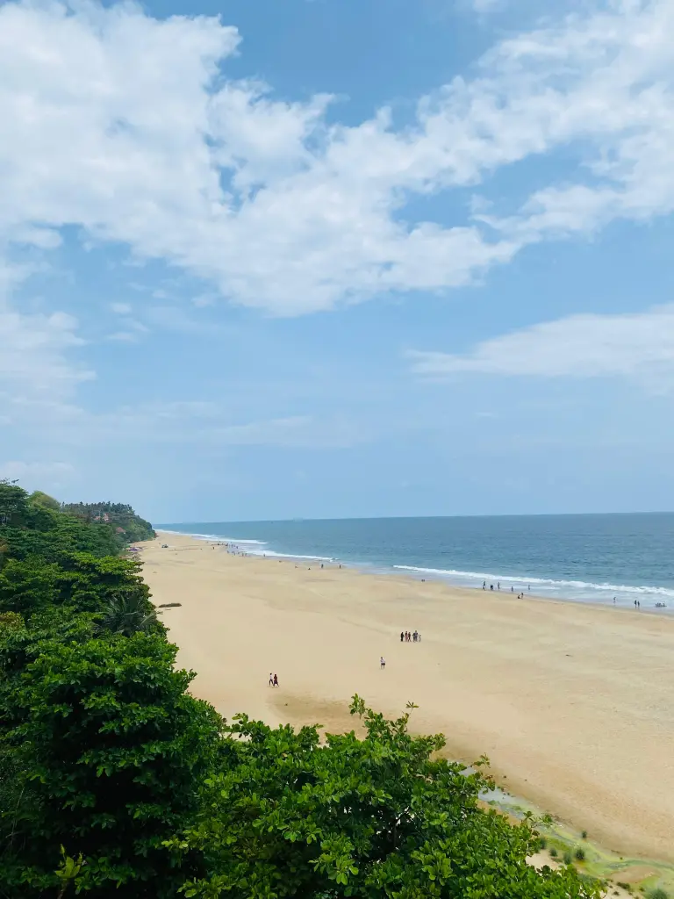
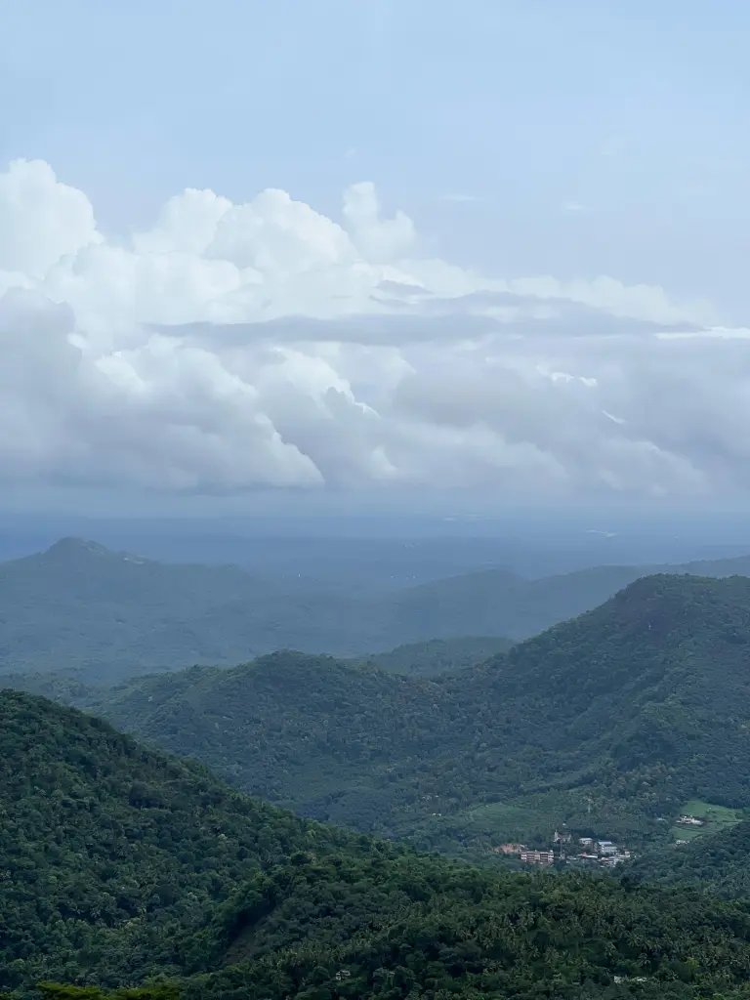
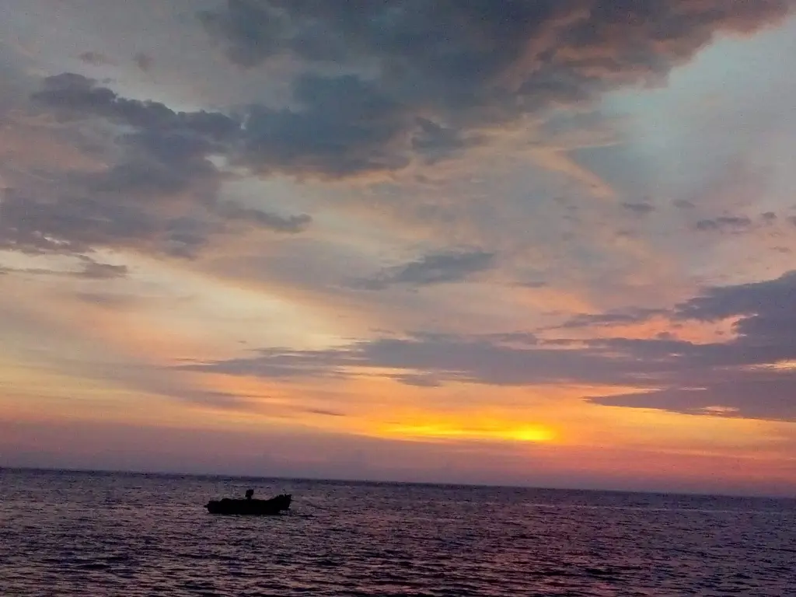
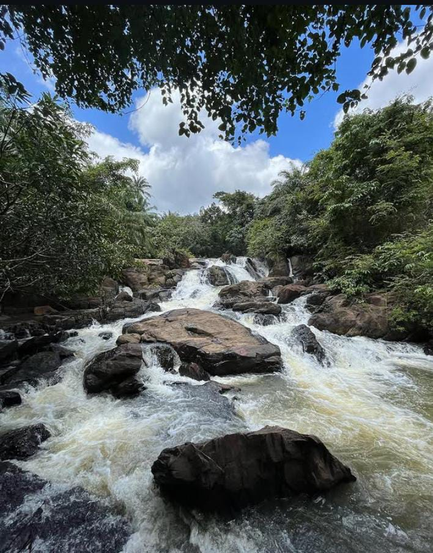
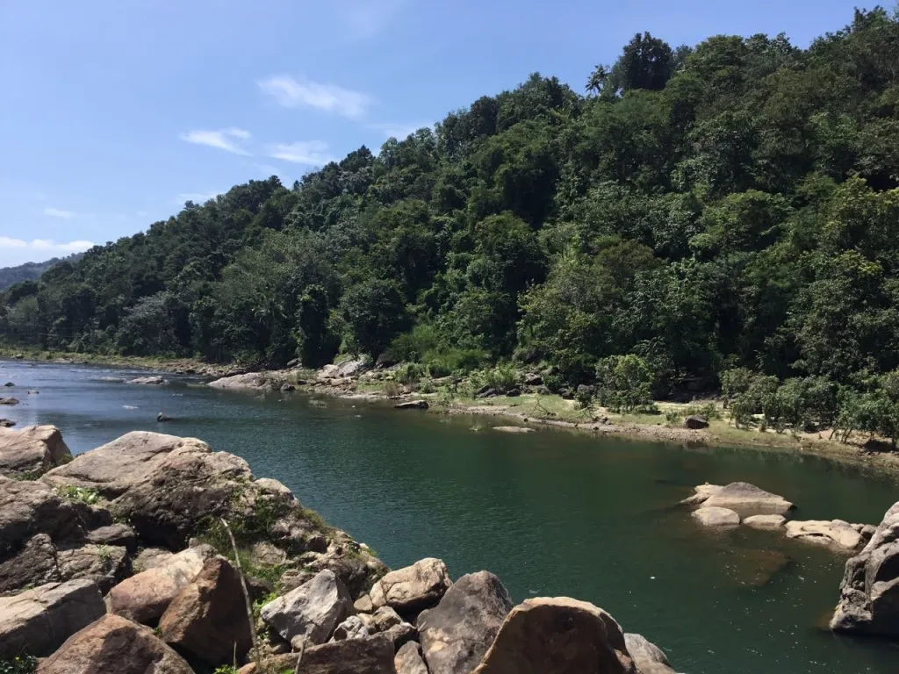
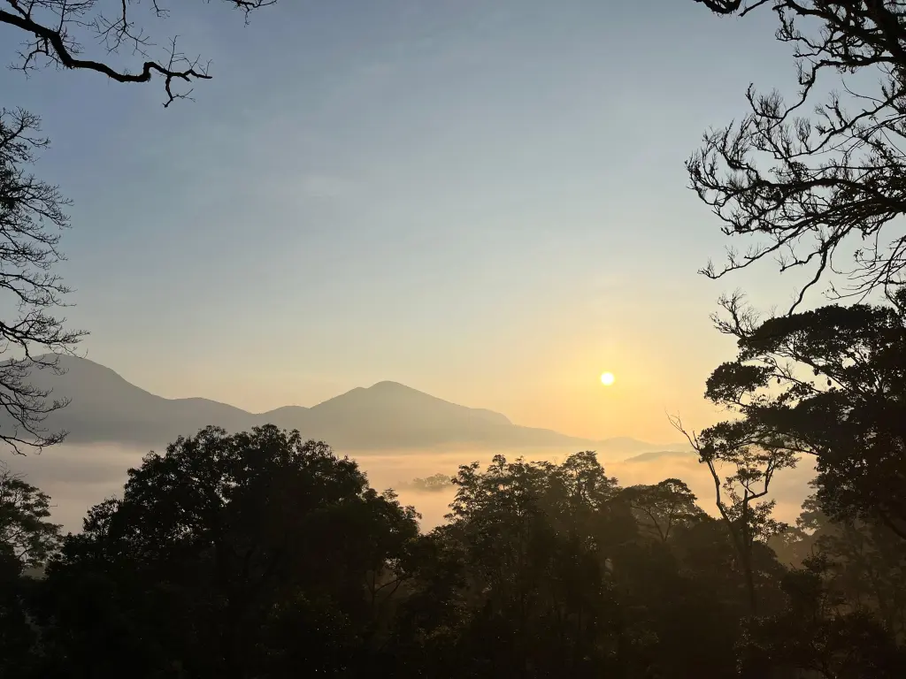
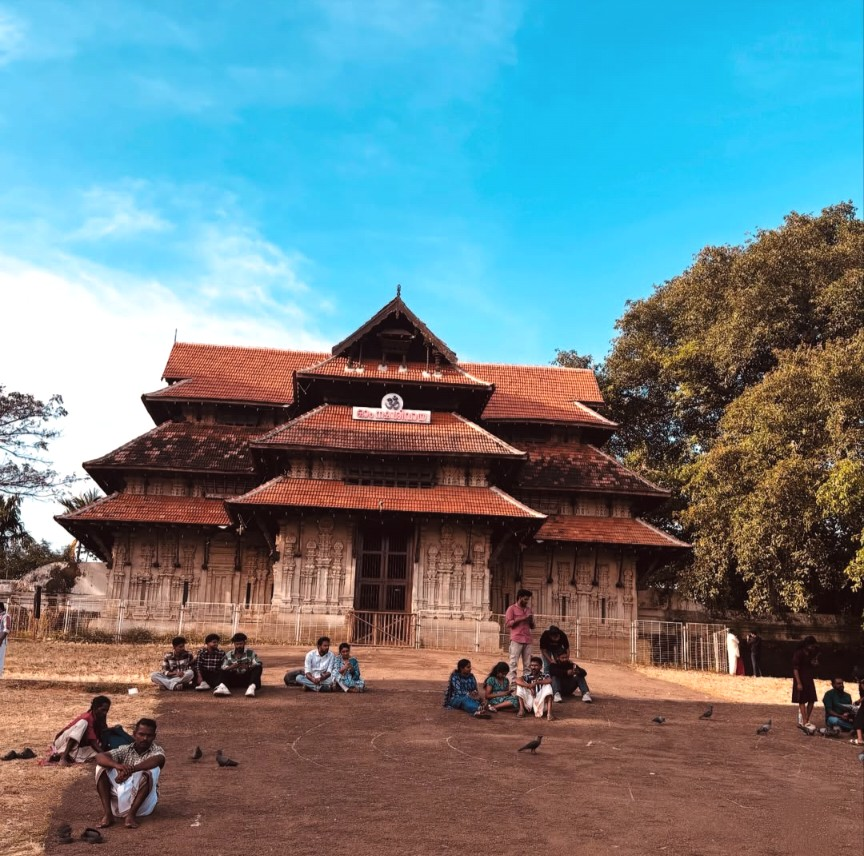
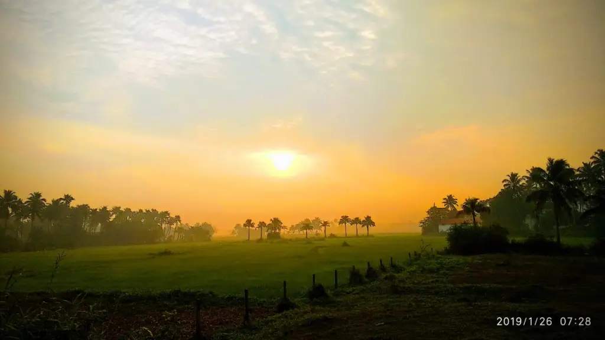

Kerala, known as “God’s Own Country”, offers a perfect blend of history, culture, and naturalbeauty. Here are the top 10 must-visit destinations you shouldn’t miss:

1. **Fort Kochi – The Colonial Charm**

A fusion of Portuguese, Dutch, and British heritage, Fort Kochi is famous for its Chinese fishing nets, art cafés, and historical sites like Mattancherry Palace and St. Francis Church.

2. **Alappuzha – The Venice of the East**

Experience Kerala’s iconic backwaters with a houseboat cruise through Alappuzha’s serene canals. The annual Nehru Trophy Boat Race and Marari Beach add to its charm.

3. **Varkala – Cliffside Serenity**

Varkala’s stunning cliffs overlook the Arabian Sea, making it a unique beach destination. Papanasam Beach, the Varkala Cliff Walk, and Janardanaswamy Temple attract both nature lovers and spiritual seekers.

4. **Kannur – The Land of Theyyam**

Known for its pristine beaches like Muzhappilangad Drive-in Beach, Kannur is also famous for its Theyyam performances, St. Angelo Fort, and Arakkal Museum.

5. **Kozhikode – The Spice Capital**

A historic trade hub, Kozhikode (Calicut) boasts beautiful beaches like Kappad, vibrant markets, and delicious Malabar cuisine, including the legendary Kozhikode biryani.

6. **Kollam – The Gateway to the Backwaters**

Kollam is known for Ashtamudi Lake, where you can enjoy a scenic boat ride. Other attractions include Palaruvi Waterfalls, Thangassery Lighthouse, and Jatayu Earth’s Center, home to the world’s largest bird sculpture.

7. **Pathanamthitta – The Pilgrim’s Haven**

Home to Sabarimala Temple, one of the biggest pilgrimage sites in India, Pathanamthitta also offers breathtaking spots like Perunthenaruvi Waterfalls and Gavi eco-tourism.

8. **Idukki – A Hill Station Wonderland**

Famous for its rolling tea plantations, Idukki is home to Thekkady’s Periyar Wildlife Sanctuary, Vagamon’s meadows, and the stunning Idukki Arch Dam.

9. **Thrissur – The Cultural Capital**

Thrissur is synonymous with the grand Thrissur Pooram festival. Explore Vadakkunnathan Temple, Kerala Kalamandalam (arts academy), and the scenic Athirappilly Waterfalls.

10. **Palakkad – Gateway to Kerala**

A land of paddy fields and historical forts, Palakkad is home to Palakkad Fort, MalampuzhaDam & Gardens, and Silent Valley National Park, a biodiversity hotspot.

Each of these destinations showcases Kerala’s rich heritage and natural beauty.
Which place are you excited to explore first?