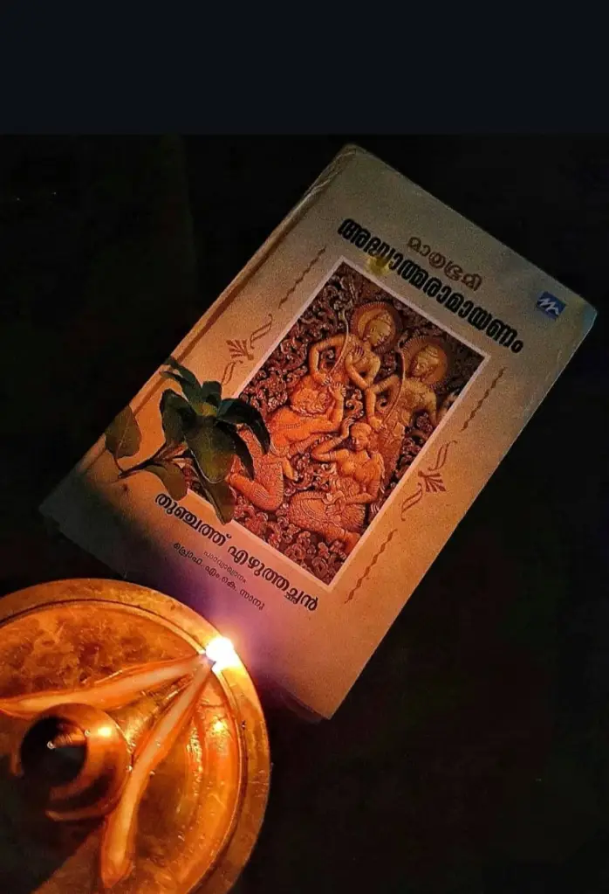
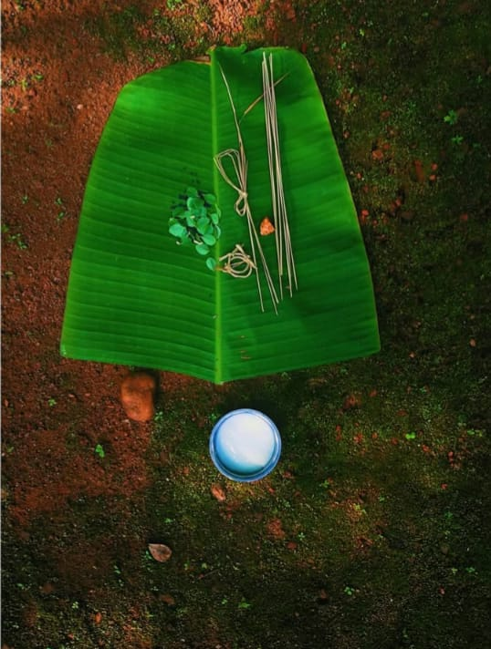
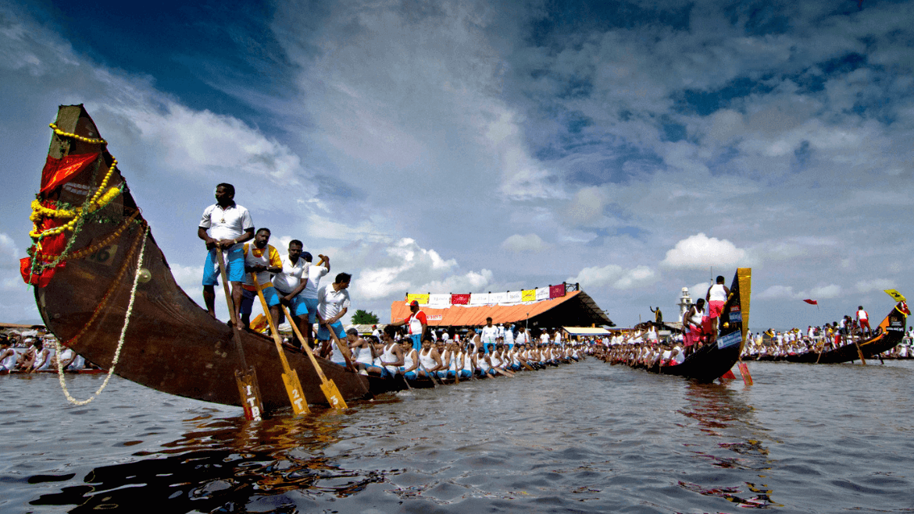
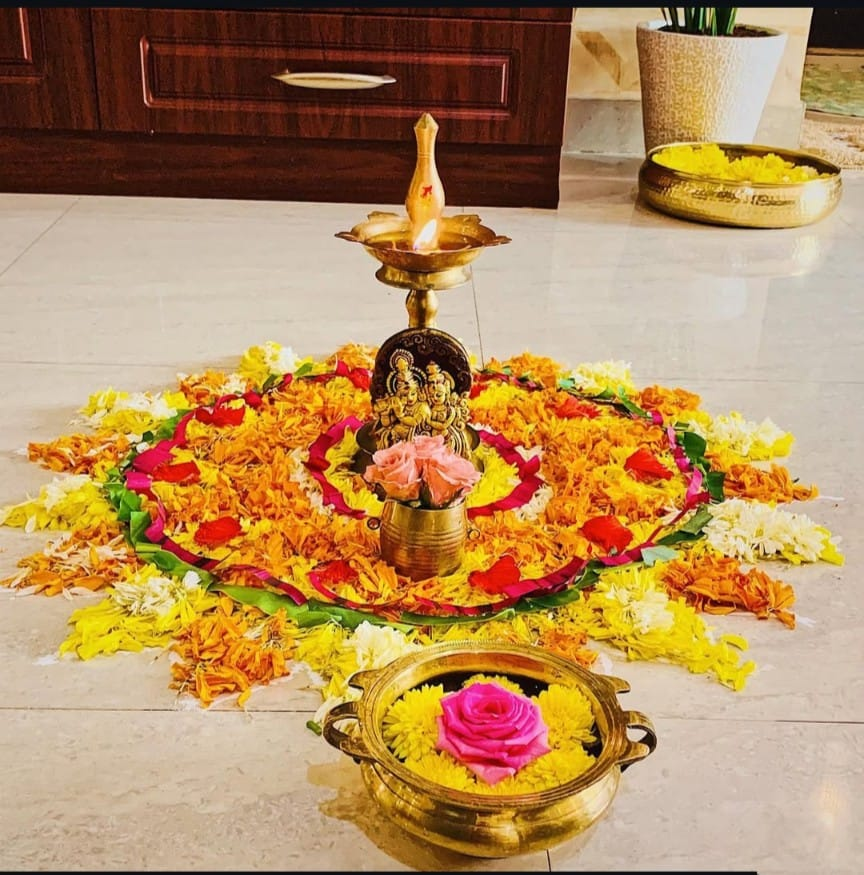

Kerala, is a place where nature and culture intertwined harmoniously. One of the most awaited and cherished times of the year in Kerala is the monsoon. The rains are not merely a seasonal change but an integral part of life, celebrated with joy, rituals, festivals, and rejuvenation therapies. The monsoon in Kerala is a season of renewal, devotion, and prosperity.

## The Arrival of the Monsoon: A Divine Blessing

The monsoon usually arrives in Kerala by early June, marking the beginning of a season that replenishes the land and the spirit of its people. Traditionally, Keralites welcome the rains with open arms, as the monsoon is seen as a life-giving force. Farmers rejoice, as the rains bring fertility to the fields, and rivers and lakes brim with fresh water. The scent of wet earth, the rhythmic sound of raindrops, and the cool breeze create an atmosphere that is both mystical and soothing.

## The Festivals of the Monsoon

1. Karkidakam: The Month of Spirituality and Healing

In the Malayalam calendar, the last month, Karkidakam (July-August), is considered a sacred time when people turn to spirituality and self-purification. Often called the ‘Ramayana Month,’ this period is marked by the recitation of the Ramayana in households and temples. Families gather to read the holy text, believing that it brings peace and prosperity during the challenging monsoon season. This month is also a time for Ayurvedic rejuvenation, as the body is believed to be more receptive to healing therapies during this time.

2. Karkidaka Vavu Bali: Honoring the Ancestors

One of the most significant rituals performed during the monsoon is Karkidaka Vavu Bali, an offering made to ancestors. Thousands of devotees gather at riverbanks and beaches, such as Varkala and Aluva, to perform Bali Tharpanam, a ritual of paying homage to departed souls. It is believed that offering prayers during this time brings blessings and helps the souls attain moksha (liberation).

3. Nehru Trophy Boat Race: A Spectacle on Water

The monsoon season also brings the excitement of the Nehru Trophy Boat Race, held in August on the Punnamada Lake in Alappuzha. This grand event sees beautifully decorated snake boats (chundan vallams) slicing through the waters, with hundreds of oarsmen rowing in perfect rhythm. The race is not just a competition but a vibrant celebration of Kerala’s cultural heritage, drawing tourists and locals alike.

4. Onam: The Grand Festival of Harvest and Unity

Though Onam falls at the end of the monsoon (August-September), its preparations begin during the rainy season. Onam is a festival that commemorates the mythical King Mahabali’s homecoming and celebrates Kerala’s agrarian prosperity. Homes are adorned with floral carpets (pookalam), people indulge in a grand feast (Onam sadya), and traditional games, music, and dances mark the occasion. The monsoon rains play a crucial role in ensuring a bountiful harvest, making Onam a true thanksgiving festival.

## Ayurveda and the Monsoon: The Season of Rejuvenation

Kerala is renowned for its Ayurveda, and the monsoon season is considered the best time for Ayurvedic treatments. According to Ayurvedic principles, the body is highly receptive to therapy during the rainy season, as the cool, moist climate opens up the pores, allowing deeper absorption of medicinal oils and herbs.

1. Karkidaka Chikitsa: The Monsoon Detox

During Karkidakam, many people undergo Karkidaka Chikitsa, a specialized Ayurvedic detox program that includes body massages with medicated oils, herbal steam baths, and dietary changes. The traditional Karkidaka Kanji, a medicinal rice porridge made with herbs and spices, is consumed to boost immunity and digestion during this time.

2. Panchakarma: The Fivefold Purification Therapy

The monsoon season is ideal for undergoing Panchakarma, a five-step detoxification process that removes toxins, strengthens the immune system, and restores balance in the body. Many travelers visit Kerala’s renowned Ayurvedic centers to experience authentic Panchakarma therapies, making wellness tourism a significant part of monsoon travel.

## Monsoon Tourism: A Different Experience of Kerala

While many travelers seek sunny skies, monsoon tourism in Kerala is an entirely different experience. The lush greenery, mist-covered hills, and overflowing waterfalls make it a paradise for nature lovers. Some of the best destinations to visit during the monsoon include:

1. Athirappilly Waterfalls: Often called the ‘Niagara of India,’ Athirappilly is breathtaking during the rains.

2. Munnar: The rolling tea plantations and misty valleys make it an ideal monsoon retreat.

3. Wayanad: A perfect spot for trekking and enjoying rain-drenched forests.

4. Kumarakom and Alleppey: The backwaters take on a magical charm, offering serene houseboat experiences.

5. Thekkady: The Periyar Wildlife Sanctuary becomes even more vibrant with the monsoon showers.

## Embracing the Rains with Open Arms

The monsoon in Kerala is not just about rainfall; it is a season of cultural vibrancy, spiritual cleansing, and natural rejuvenation. From age-old rituals and festivals to Ayurvedic therapies and breathtaking landscapes, the rains bring life and energy to this beautiful land. Whether you are seeking adventure, wellness, or cultural experiences, Kerala’s monsoon offers an unforgettable journey into a world where nature and tradition blend seamlessly. So, the next time you think of Kerala, don’t just picture the golden beaches and sunny skies—imagine the rhythmic patter of raindrops, the fragrance of wet earth, and the timeless traditions that make this season truly magical.